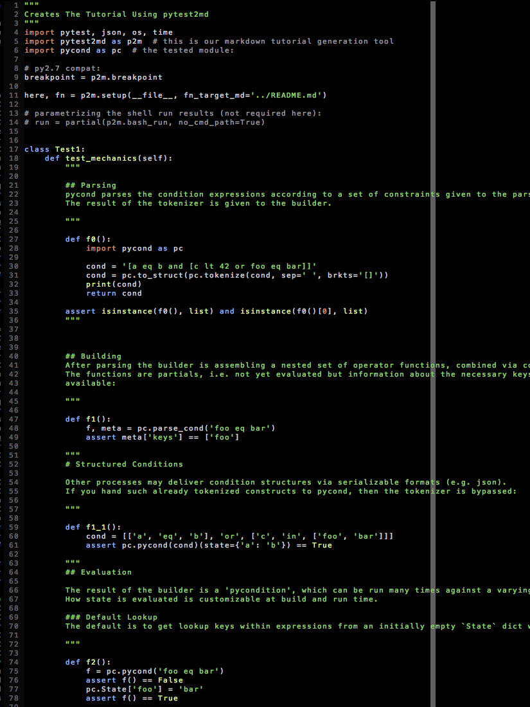

---

author: gk
version: 190428

---

# Generating Markdown - While Testing Contained Claims

[](https://travis-ci.org/axiros/pytest2md) [](https://codecov.io/gh/axiros/pytest2md)[![PyPI    version][pypisvg]][pypi] [![][blacksvg]][black]

[blacksvg]: https://img.shields.io/badge/code%20style-black-000000.svg
[black]: https://github.com/ambv/black
[pypisvg]: https://img.shields.io/pypi/v/pytest2md.svg
[pypi]: https://badge.fury.io/py/pytest2md

<!-- badges: http://thomas-cokelaer.info/blog/2014/08/1013/ -->


<!-- only hoster for this repo is github, so we fix the links: -->
<!-- md_links_for: github -->

<!-- TOC -->

# Table Of Contents

- <a name="toc1"></a>[Inline Python Function Execution](#inline-python-function-execution)
- <a name="toc2"></a>[Tools](#tools)
    - <a name="toc3"></a>[html_table](#html-table)
    - <a name="toc4"></a>[TOC](#toc)

<!-- TOC -->

Few things are more annoying than stuff which does not work as announced,
especially when you find out only after an invest of time and energy.

Documentation is often prone to produce such situations, since hard to keep
100% in sync with the code evolution.

<!-- autogen tutorial -->


This is a set of tools, *generating* documentation, while verifying the documented
claims about code behaviour - without the need to adapt the source code, e.g. by modifying
doc strings:



> When the documentation is using a lot of code examples then a very welcome
additional benefit of writing it like shown is the availability of [source
code autoformatters](https://github.com/ambv/black).

Other Example:

This "README.md" was built into [this](./.README.tmpl.md) template,
where [html comment style placeholders][.README.tmpl.md]
had been replaced while running pytest on this testfile:

```python
"""
Creates Readme - while testing functions of p2m.


While pytest is running we simply assemble from scratch an intermediate .md file
in append only mode, located within the tests folder.
This we insert between two seperators in the target markdown file, as the last
test function, done.
"""
import pytest2md as p2m
import pytest, json, os, time
from functools import partial
from uuid import uuid4
import json

# a P2M instance contains all we need:
p2m = p2m.P2M(__file__, fn_target_md='README.md')


# parametrizing the shell run results:
run = partial(p2m.bash_run, no_cmd_path=True)


doc_src = partial(
    p2m.md_from_source_code, pre_md='Generated by:', no_sh_func_output=True
)
md = p2m.md


class TestChapter1:
    def test_one(self):
        t = """

        This is a set of tools, *generating* documentation, while verifying the documented
        claims about code behaviour - without the need to adapt the source code, e.g. by modifying
        doc strings:

        

        > When the documentation is using a lot of code examples then a very welcome
        additional benefit of writing it like shown is the availability of [source
        code autoformatters](https://github.com/ambv/black).

        Other Example:

        This "README.md" was built into [this](./.README.tmpl.md) template,
        where [title:html comment style placeholders,fmatch:.README.tmpl.md,show_raw:True]<SRC>
        had been replaced while running pytest on this testfile:

        <from_file: %s>

        """ % (
            __file__,
        )

        p2m.md(t)
        p2m.md(
            """
        Lets run a bash command and assert on its results.
        Note that the command is shown in the readme, incl. result and the result
        can be asserted upon.
        """
        )

        res = run('cat "/etc/hosts" | grep localhost')
        assert '127.0.0.1' in res[0]['res']

    def test_two(self):
        res = run(['ls "%(d_test)s"' % p2m.ctx, 'ls -lta /etc/hosts'])
        assert 'tutorial' in res[0]['res']
        assert 'hosts' in res[1]['res']

    def test_simple_pyfuncs(self):
        """
        # Inline Python Function Execution

        via the `md_from_source_code` function you can write fluent markdown
        (tested) python combos:
        """

        def foo():
            hi = 'hello world'
            assert 'world' in hi
            print(hi.replace('world', 'joe'))

        """
        The functions are evaluated and documented in the order they show up
        within the textblocks.

        > Please keep tripple apostrophes - we split the text blocks,
        searching for those.

        State is kept within the outer pytest function, like normally in python.
        I.e. if you require new state, then start a new pytest function.

        Stdout is redirected to an output collector function, i.e. if you print
        this does result in an "Output" block. If the printout starts with
        "MARKDOWN:" then we won't wrap that output into fenced code blocks but
        display as is.

        > If the string 'breakpoint' occurs in a function body, we won't redirect
        standardout for displaying output.

        # Tools

        ## html_table

        """

        def mdtable():
            ht = p2m.html_table

            print(ht([['foo', 'bar'], ['bar', 'baz']], ['h1', 'h2']))
            print('As details when summary arg is given:')
            t = ht(
                [['joe', 'doe'], ['suzie', 'wong']],
                ['first', 'last'],
                summary='names. click to open...',
            )
            assert 'details' in t
            assert 'joe</td' in t
            print(t)

        doc_src()

    def test_toc(self):
        p2m.md(
            """
        ## TOC

            p2m.write_markdown(with_source_ref=True, make_toc=True)

        See this tutorial.

        """
        )

    def test_file_create_show(self):
        p2m.md('## sh_file')
        fn = '/tmp/' + str(uuid4())
        ts = time.ctime()
        c = json.dumps({'a': [{'testfile': 'created'}, 'at', ts]}, indent=4)

        def shf():
            # if content is given it will create it:
            p2m.sh_file(fn, lang='javascript', content=c)
            # summary arg creates a details structure:
            p2m.sh_file(fn, lang='javascript', content=c, summary='as details')
            # creates a link (say True to have the filename as link text)
            p2m.sh_file(fn, lang='javascript', content=c, as_link=True)
            p2m.sh_file(fn, lang='javascript', content=c, as_link='as link')

        doc_src()
        # check existance:
        with open(fn) as fd:
            assert fd.read() == c
        os.unlink(fn)

    def test_bash_run(self):
        p2m.md('## bash_run')

        def br():
            run = partial(p2m.bash_run, no_cmd_path=True)
            # by default we search in assets for the command to run:
            res = p2m.bash_run('some_command_in_assets arg1 2>&1')
            assert 'No such file' in res[0]['res']
            res = run('cat /etc/hostname | grep local | head -n 1')
            assert 'local' in res[0]['res']
            res = run('cat /etc/hostname', into_file='bash_run.txt')
            assert 'local' in res[0]['res']
            # Ending with .html it converts ansi escape colors to html:
            # simple link is created.
            # (requires pip install ansi2html)
            run('cat /etc/resolv.conf', into_file='bash_run.html')

        doc_src()

    def test_md_from_source_code(self):
        p2m.md('## md_from_source_code')

        def br():
            def func1():
                p2m.md('Inserted markdown from running python.')
                print('From output of running python ')

            def func2():
                print('From another function')

            p2m.md_from_source_code()

        doc_src()

    def test_mdtool(self):
        md = """
        # Link Replacements

        Technical markdown content wants to link to source code often.
        How to get those links working and that convenient?

        The module does offer also some source finding / link replacement feature,
        via the [mdtool]<SRC> module. The latter link was built simply by this:

        ```
        [mdtool]<SRC>
        ```


        Other example: This [pytest2md]<SRC> link was created by replacing "SRC" with the path
        to a file matching, under a given directory, prefixed by an arbitrary base URL.

        ## Spec

        These will be replaced:

        `[title:this,fmatch:test_tutorial,lmatch:line_match] <SRC>` (remove space between] and <)

        - title: The link title - text the user reads
        - fmatch: substring match for the link destination file
        - lmatch: Find matching line within that file
        - show_raw: Link to raw version of file, not the one rendered by the
          repo server
        - path: Fix file path (usually derived by fmach)
        - line: Fix the line number of the link (usually done via lmatch)

        ## Code Repo Hoster Specific Source Links

        Github, Gitlab, Bitbucked or Plain directory based static content servers
        all have their conventional URLs regarding those links.

        Since all of these are just serving static content w/o js possibilities,
        you have to parametrize the intended hoster in your environment, before
        running a pytest / push cycle. That way the links will be working on the hoster.

        Currently we understand the following namespaces for links:


        ```javascript
        _link_names_
        ```

        ### Setting a link template

        - `export MD_LINKS_FOR=github   ` # before running pytest / push
        - `<!-- md_links_for: github -->` # in the markdown template, static

        The latter can be overwritten by environ, should you want to push from time to time
        to a different code hoster.

        ### Link Refs

        We minimize the problem of varying generated target markdown, dependent on the hoster.
        How? Like [any problem in IT is solved](https://en.wikipedia.org/wiki/Fundamental_theorem_of_software_engineering).


        By building [reference links](https://github.com/adam-p/markdown-here/wiki/Markdown-Cheatsheet#links)
        the differences of e.g. a README.md for github vs. gitlab is
        restricted to the links section on the end of the generated markdown.
        In the markdown bodies you'll just see link names, which remain the same.

        > Check the end of the [title:rendering result,fmatch:README.md,show_raw:True]<SRC> at the end of this README.md,
        in order to see the results for the hoster you are reading this markdown file currently.

        ## Summary

        - At normal runs of pytest, the link base URL is just a local `file://` link,

        - Before pushes one can set via environ (e.g. `export
          MD_LINKS_FOR=github`)  these e.g. to the github base URL or the repo.

        - `[key-values]` constructs are supported as well, extending to beyond
          just the base url. Example following:

        """.replace(
            '_link_names_',
            json.dumps(p2m.src_link_templates, indent=4, sort_keys=2),
        )
        p2m.md(md)

    def test_sh_code(self):
        p2m.md('Source code showing is done like this:')
        p2m.sh_code(self.test_sh_code)
        p2m.md(
            '> Is [title:this,fmatch:test_tutorial,lmatch:exotic]<SRC> an exotic form of a recursion? ;-)  '
        )

    def test_write(self):
        """has to be the last 'test'"""
        # default is ../README.md
        p2m.write_markdown(with_source_ref=True, make_toc=True)
```


Lets run a bash command and assert on its results.
Note that the command is shown in the readme, incl. result and the result
can be asserted upon.
```bash
$ cat "/etc/hosts" | grep localhost
127.0.0.1   localhost localhost.localdomain localhost4 localhost4.localdomain4
::1         localhost localhost.localdomain localhost6 localhost6.localdomain6
```
```bash
$ ls "/root/git/pytest2md/tests"
__pycache__
test_basics.py
test_changelog.py
test_tutorial.py

$ ls -lta /etc/hosts
-rw-r--r--. 1 root root 158 Apr  9 09:47 /etc/hosts
```

Generated by:

# <a href="#toc1">Inline Python Function Execution</a>

via the `md_from_source_code` function you can write fluent markdown
(tested) python combos:  

```python
hi = 'hello world'
assert 'world' in hi
print(hi.replace('world', 'joe'))
```

The functions are evaluated and documented in the order they show up
within the textblocks.

> Please keep tripple apostrophes - we split the text blocks,
searching for those.

State is kept within the outer pytest function, like normally in python.
I.e. if you require new state, then start a new pytest function.

Stdout is redirected to an output collector function, i.e. if you print
this does result in an "Output" block. If the printout starts with
"MARKDOWN:" then we won't wrap that output into fenced code blocks but
display as is.

> If the string 'breakpoint' occurs in a function body, we won't redirect
standardout for displaying output.

# <a href="#toc2">Tools</a>

## <a href="#toc3">html_table</a>
  

```python
ht = p2m.html_table

print(ht([['foo', 'bar'], ['bar', 'baz']], ['h1', 'h2']))
print('As details when summary arg is given:')
t = ht(
    [['joe', 'doe'], ['suzie', 'wong']],
    ['first', 'last'],
    summary='names. click to open...',
)
assert 'details' in t
assert 'joe</td' in t
print(t)
```

## <a href="#toc4">TOC</a>

    p2m.write_markdown(with_source_ref=True, make_toc=True)

See this tutorial.

## sh_file
```javascript
$ cat "9b4450a7-a413-4987-9fb8-dfa365b59aa4"
{
    "a": [
        {
            "testfile": "created"
        },
        "at",
        "Mon Jun 10 21:19:23 2019"
    ]
}
```

<details><summary>as details</summary>

```javascript
$ cat "9b4450a7-a413-4987-9fb8-dfa365b59aa4"
{
    "a": [
        {
            "testfile": "created"
        },
        "at",
        "Mon Jun 10 21:19:23 2019"
    ]
}
```
</details>

[9b4450a7-a413-4987-9fb8-dfa365b59aa4](./tests/assets/sh_files/9b4450a7-a413-4987-9fb8-dfa365b59aa4)

[as link](./tests/assets/sh_files/9b4450a7-a413-4987-9fb8-dfa365b59aa4)

Generated by:


```python
# if content is given it will create it:
p2m.sh_file(fn, lang='javascript', content=c)
# summary arg creates a details structure:
p2m.sh_file(fn, lang='javascript', content=c, summary='as details')
# creates a link (say True to have the filename as link text)
p2m.sh_file(fn, lang='javascript', content=c, as_link=True)
p2m.sh_file(fn, lang='javascript', content=c, as_link='as link')
```
## bash_run
```bash
$ ./some_command_in_assets arg1 2>&1
/bin/sh: /root/git/pytest2md/tests/assets/some_command_in_assets: No such file or directory
```
```bash
$ cat /etc/hostname | grep local | head -n 1
localhost.localdomain
```
```bash
$ cat /etc/hostname
localhost.localdomain

...(output truncated - see link below)
```
- [Output](./tests/assets/bash_run_outputs/bash_run.txt) of `cat /etc/hostname`  

```bash
$ cat /etc/resolv.conf
```

[cat /etc/resolv.conf](./tests/assets/bash_run_outputs/bash_run.html)


Generated by:


```python
run = partial(p2m.bash_run, no_cmd_path=True)
# by default we search in assets for the command to run:
res = p2m.bash_run('some_command_in_assets arg1 2>&1')
assert 'No such file' in res[0]['res']
res = run('cat /etc/hostname | grep local | head -n 1')
assert 'local' in res[0]['res']
res = run('cat /etc/hostname', into_file='bash_run.txt')
assert 'local' in res[0]['res']
# Ending with .html it converts ansi escape colors to html:
# simple link is created.
# (requires pip install ansi2html)
run('cat /etc/resolv.conf', into_file='bash_run.html')
```
## md_from_source_code
Inserted markdown from running python.

```python
p2m.md('Inserted markdown from running python.')
print('From output of running python ')
```
Output:

```
From output of running python
```

```python
print('From another function')
```
Output:

```
From another function
```

Generated by:


```python
def func1():
    p2m.md('Inserted markdown from running python.')
    print('From output of running python ')

def func2():
    print('From another function')

p2m.md_from_source_code()
```

# Link Replacements

Technical markdown content wants to link to source code often.
How to get those links working and that convenient?

The module does offer also some source finding / link replacement feature,
via the [mdtool][mdtool.py] module. The latter link was built simply by this:

```
[mdtool]<SRC>
```


Other example: This [pytest2md link was created by replacing "SRC" with the path
to a file matching, under a given directory, prefixed by an arbitrary base URL.

## Spec

These will be replaced:

`[title:this,fmatch:test_tutorial,lmatch:line_match] <SRC>` (remove space between] and <)

- title: The link title - text the user reads
- fmatch: substring match for the link destination file
- lmatch: Find matching line within that file
- show_raw: Link to raw version of file, not the one rendered by the
  repo server
- path: Fix file path (usually derived by fmach)
- line: Fix the line number of the link (usually done via lmatch)

## Code Repo Hoster Specific Source Links

Github, Gitlab, Bitbucked or Plain directory based static content servers
all have their conventional URLs regarding those links.

Since all of these are just serving static content w/o js possibilities,
you have to parametrize the intended hoster in your environment, before
running a pytest / push cycle. That way the links will be working on the hoster.

Currently we understand the following namespaces for links:


```javascript
{
    "github": "https://github.com/%(gh_repo_name)s/blob/%(git_rev)s/%(path)s%(line:#L%s)s",
    "github_raw": "https://raw.githubusercontent.com/%(gh_repo_name)s/%(git_rev)s/%(path)s%(line:#L%s)s",
    "static": "file://%(d_repo_base)s/%(path)s",
    "static_raw": "file://%(d_repo_base)s/%(path)s"
}
```

### Setting a link template

- `export MD_LINKS_FOR=github   ` # before running pytest / push
- `<!-- md_links_for: github -->` # in the markdown template, static

The latter can be overwritten by environ, should you want to push from time to time
to a different code hoster.

### Link Refs

We minimize the problem of varying generated target markdown, dependent on the hoster.
How? Like [any problem in IT is solved](https://en.wikipedia.org/wiki/Fundamental_theorem_of_software_engineering).


By building [reference links](https://github.com/adam-p/markdown-here/wiki/Markdown-Cheatsheet#links)
the differences of e.g. a README.md for github vs. gitlab is
restricted to the links section on the end of the generated markdown.
In the markdown bodies you'll just see link names, which remain the same.

> Check the end of the [rendering result][README.md] at the end of this README.md,
in order to see the results for the hoster you are reading this markdown file currently.

## Summary

- At normal runs of pytest, the link base URL is just a local `file://` link,

- Before pushes one can set via environ (e.g. `export
  MD_LINKS_FOR=github`)  these e.g. to the github base URL or the repo.

- `[key-values]` constructs are supported as well, extending to beyond
  just the base url. Example following:

Source code showing is done like this:
```python
    def test_sh_code(self):
        p2m.md('Source code showing is done like this:')
        p2m.sh_code(self.test_sh_code)
        p2m.md(
            '> Is [title:this,fmatch:test_tutorial,lmatch:exotic]<SRC> an exotic form of a recursion? ;-)  '
        )

```
> Is [this][test_tutorial.py#282] an exotic form of a recursion? ;-)  


*Auto generated by [pytest2md](https://github.com/axiros/pytest2md), running [test_tutorial.py][test_tutorial.py]*

<!-- autogen tutorial -->

# Isolation

None. If you would screw up your host running pytest normally, then you will
get the same result, when running markdown generating tests.

----

[Here](https://github.com/axiros/pycond) is a bigger tutorial, from `pytest2md`.


<!-- autogenlinks -->
[.README.tmpl.md]: https://raw.githubusercontent.com/axiros/pytest2md/f659f2bb85a1d482f420f16cabbcf271e0d12915/.README.tmpl.md
[README.md]: https://raw.githubusercontent.com/axiros/pytest2md/f659f2bb85a1d482f420f16cabbcf271e0d12915/README.md
[mdtool.py]: https://github.com/axiros/pytest2md/blob/f659f2bb85a1d482f420f16cabbcf271e0d12915/pytest2md/mdtool.py
[test_tutorial.py]: https://github.com/axiros/pytest2md/blob/f659f2bb85a1d482f420f16cabbcf271e0d12915/tests/test_tutorial.py
[test_tutorial.py#282]: https://github.com/axiros/pytest2md/blob/f659f2bb85a1d482f420f16cabbcf271e0d12915/tests/test_tutorial.py#L282